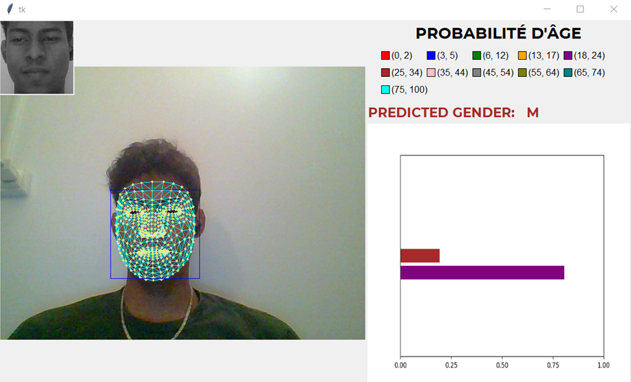

# Age_gender_recognition_by_deep_learning
In-depth analysis of the convolutional neural network

Sample of the results obtained in the development of an application capable of categorizing age and gender helped by deep learning

The training of the model was done with the help of tensorflow keras and the UTKFace database was used with the following data distribution

After the analysis we see similarity in the kernels learned by the CNN

